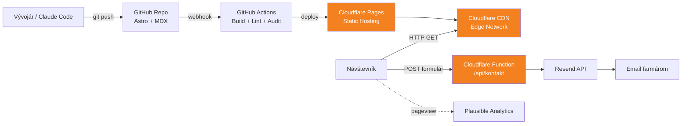
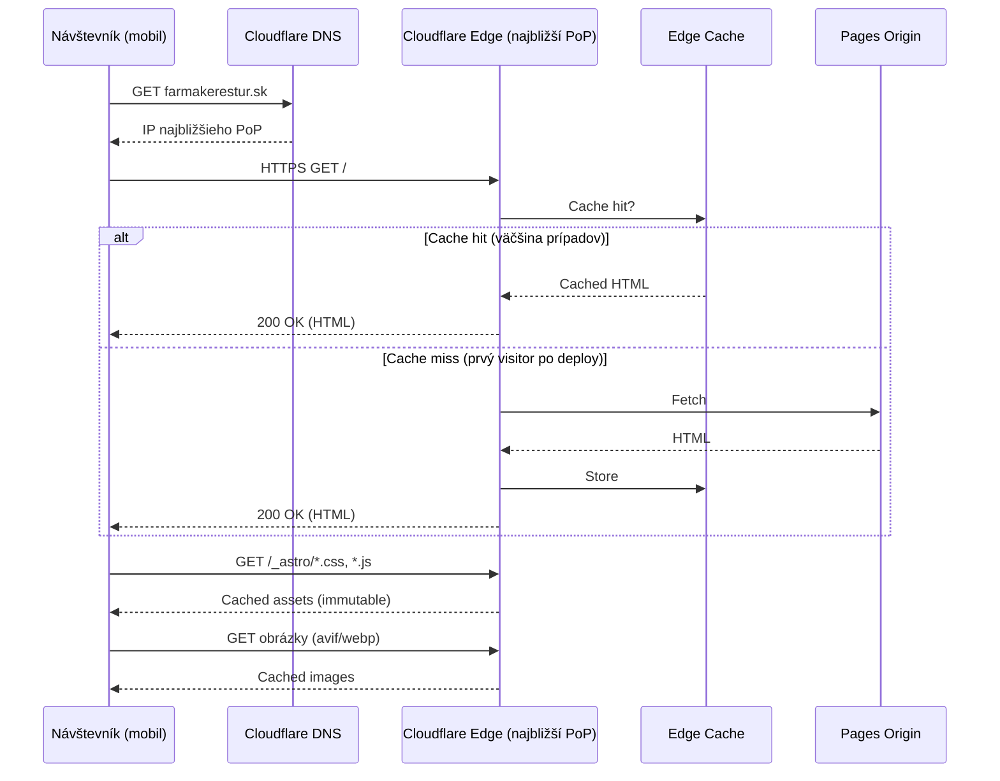
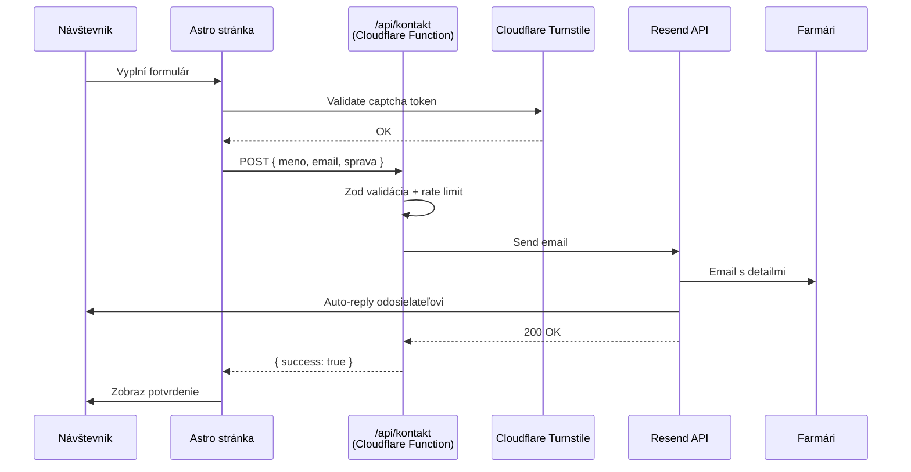
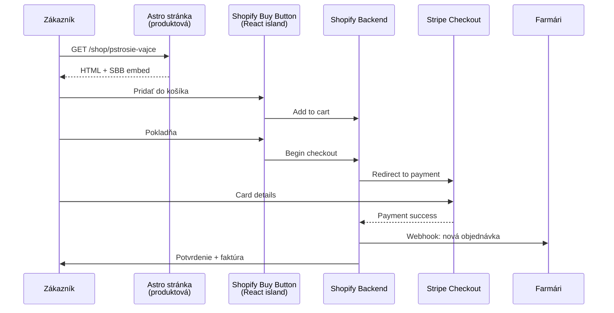

# Architecture Diagrams — farmakerestur.sk

> Foundational document. Sets the HOW. Mermaid diagrams renderujú v GitHube aj v Markdown vieweroch.

## 1. System Architecture (high-level)

Statická aplikácia distribuovaná cez Cloudflare edge. Žiadna databáza vo fáze 1, žiadny vlastný backend okrem stateless funkcií pre formuláre.

## 2. Content Authoring Flow (fáza 1 vs fáza 2)

Fáza 1: developer commituje MDX manuálne. Fáza 2: farmár používa Keystatic GUI.

```mermaid
graph TD
    subgraph "Fáza 1 — MDX-first"
        D1[Developer] -->|edit| MDX1[MDX súbory v repe]
        MDX1 -->|git commit + push| GH1[GitHub]
        GH1 -->|webhook| Build1[Astro Build]
        Build1 -->|deploy| Site1[farmakerestur.sk]
    end

    subgraph "Fáza 2 — Keystatic GUI"
        Farmer[Farmár] -->|edit cez GUI| KS[Keystatic UI]
        KS -->|GitHub OAuth| GH2[GitHub API]
        GH2 -->|commit/PR| MDX2[MDX súbory]
        MDX2 -->|webhook| Build2[Astro Build]
        Build2 -->|deploy| Site2[farmakerestur.sk]
    end

    style Farmer fill:#fbbf24,color:#000
    style KS fill:#3b82f6,color:#fff
```

## 3. Visitor Request Flow (sequence)

Typická návšteva — všetko statické, cached na edge.

## 4. Contact Form Submission (sequence)

## 5. Future E-shop Flow (fáza 3, sequence)

Shopify embed handluje payment a inventory mimo nášho kódu.

## 6. Deployment Pipeline

```mermaid
graph LR
    PR[Pull Request]
    Lint[Lint + Type Check]
    Build[Astro Build]
    Audit[web-quality-skills audit]
    Preview[Cloudflare Preview Deploy]
    Review[Manual Review]
    Main[Merge to main]
    Prod[Cloudflare Production Deploy]
    Invalidate[CDN Cache Invalidate]

    PR --> Lint
    Lint --> Build
    Build --> Audit
    Audit --> Preview
    Preview --> Review
    Review -->|approved| Main
    Main --> Prod
    Prod --> Invalidate

    style Audit fill:#10b981,color:#fff
    style Prod fill:#f48120,color:#fff
```

## Design Notes

- **Žiadne databázy v MVP** — všetko statické, žiadne dáta na serveri okrem ephemeral submit handlerov
- **Stateless funkcie len kde nutné** — kontakt formulár, prípadne v budúcnosti webhook receivery zo Shopify
- **Cache-first všade** — HTML, assety, obrázky, fonty
- **Žiadny third-party JS na blocking** — Plausible je defer, Shopify Buy Button lazy-load
- **Single failure domain** — celý stack stojí na Cloudflare. Risk akceptovaný (kvalita uptime), backup plán = static hosting kdekoľvek inde

## Future Considerations (out of MVP scope)

- **i18n** — Astro built-in routing pre SK/EN/HU keď príde čas
- **Edge personalisation** — Cloudflare Workers môžu robiť A/B test alebo geolocation-based content
- **Webhooks z farmy** — ak by bola IoT integrácia (kamery, váhy, atď.), Workers + Durable Objects
- **Newsletter** — Buttondown alebo Beehiiv ako standalone, alebo Resend Broadcast
